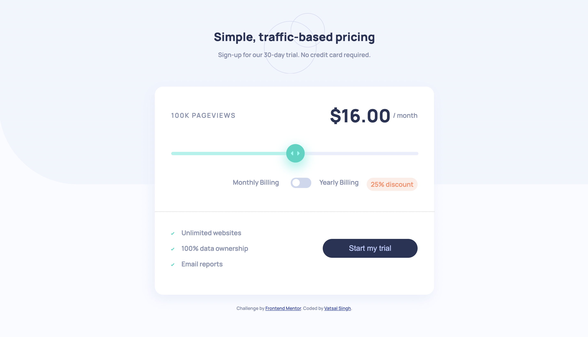

# Frontend Mentor - Interactive pricing component solution

This is a solution to the [Interactive pricing component challenge on Frontend Mentor](https://www.frontendmentor.io/challenges/interactive-pricing-component-t0m8PIyY8). Frontend Mentor challenges help you improve your coding skills by building realistic projects. 

## Table of contents

- [Overview](#overview)
  - [The challenge](#the-challenge)
  - [Screenshot](#screenshot)
  - [Links](#links)
- [My process](#my-process)
  - [Built with](#built-with)
  - [What I learned](#what-i-learned)
  - [Continued development](#continued-development)
  - [Useful resources](#useful-resources)
- [Author](#author)
- [Acknowledgments](#acknowledgments)

## Overview


### The challenge

Users should be able to:

- View the optimal layout for the app depending on their device's screen size
- See hover states for all interactive elements on the page
- Use the slider and toggle to see prices for different page view numbers

### Screenshot




### Links

- Solution URL: [https://www.frontendmentor.io/solutions/interactive-pricing-component-using-flexbox-and-jquery--Zv4OLa0k](https://www.frontendmentor.io/solutions/interactive-pricing-component-using-flexbox-and-jquery--Zv4OLa0k)
- Live Site URL: [https://vatsalsinghkv.github.io/interactive-pricing-component/](https://vatsalsinghkv.github.io/interactive-pricing-component)

## My process

### Built with

- CSS custom properties
- Flexbox
- [jQuery](https://jquery.com/) - JS library


### What I learned

I've learned lot of stuff in this challenge: 

- About Background Images.

```css
body {
    background: url("../images/bg-pattern.svg") var(--main-bg) no-repeat;
    background-size: contain;
}

.main-header {
    background: url("/images/pattern-circles.svg") no-repeat top center;
    background-size: contain;
}
```

- How to design a slider `input[type="range"]`

```html
<div class="slide-bar">
    <input type="range" name="slider" id="slider" min="1" max="5" value="3" aria-valuemin="1"
      aria-valuemax="5" aria-valuenow="3" aria-label="slider">
    <div class="slider-bg"></div>
</div>
```
```css
.slide-bar {
    position: relative;
}

#slider {
    width: 100%;
    -webkit-appearance: none;
}

#slider::-webkit-slider-thumb {
    -webkit-appearance: none;

    width: 45px;
    height: 45px;

    border-radius: 50%;
    background: url("../images/icon-slider.svg") no-repeat center var(--slide-bar-bg);
    box-shadow: 0 10px 25px  5px var(--slide-bar);
    cursor: pointer;

    margin-top: -19px;
    transition: all .25s;
    z-index: 5;
    position: relative;
}

.slider-bg {
    left: 0;
    height: 8px;
    width: 50%;
    
    position: absolute;
    background-color: hsl(174, 77%, 80%);
}

#slider::-webkit-slider-runnable-track {
    background:  hsl(224, 65%, 95%);

    height: 8px;
    cursor: pointer;
}
```

- How to make Toggle Btn

```html
<input type="checkbox" name="switch" id="btn">
				<label class="toggle-btn" for="btn"></label>
```
```css
.toggle-btn {
    display: inline-block;
    vertical-align: bottom;

    position: relative;

    width: 50px;
    height: 25px;
    margin: 0 10px;

    background-color: hsl(223, 50%, 87%);
   
    cursor: pointer;
    transition: all .25s;
}

.toggle-btn::before {
    content: '';
    position: absolute;
    
    top: 0;
    left: 4px;
    
    height: 18px;
    width: 18px;
    
    border-radius: 100%;
    
    background-color: #fff;
    cursor: pointer;
    transition: .25s;
}

/* sliding btn on click */
#btn:checked + .toggle-btn::before {
    left: 28px;
}

/* to remove default checkbox */
#btn {
    margin: 0;
    width: 0;
    height: 0;
}
```

- How to use arrow function

```js
let $slider = $('#slider');

const priceCount = (discount = 0) => {
    switch($slider[0].value) {
        case '1': return `$${8 - (8 * discount / 100)}.00`;
        case '2': return `$${12 - (12 * discount / 100)}.00`; 
        case '3': return `$${16 - (16 * discount / 100)}.00`; 
        case '4': return `$${24 - (24 * discount / 100)}.00`; 
        case '5': return `$${36 - (36 * discount / 100)}.00`; 
    }
};

$slider.change(function() {
    if($toggleBtn[0].checked) {
        $priceCount.text(priceCount(25));
    } else {
        $priceCount.text(priceCount());
    }
});

$toggleBtn.change(() => {
    if($toggleBtn[0].checked) {
        $priceCount.text(priceCount(25));
    } else {
        $priceCount.text(priceCount());
    }
});
```


### Continued development

### Stuff I find usefull and want to learn:

- Bootstrap
- Node.js
- Express
- React
- CSS Animations
- CSS Svg
- CSS Canvas
- JS Regular Expressipns
- Flutter & Dart


### Useful resources

- [TheNetNija Youtube](https://www.youtube.com/c/TheNetNinja) - This helped me learn jQuery, GitHub, CSS Grid. This guy is legend there's lot of stuff to learn, which I will be learning in future.
- [GeeksForGeeks](https://www.geeksforgeeks.org/) - This is amazing website for articles, snippets, projects, algorithms etc.
- [MDN Docs](https://developer.mozilla.org/en-US/) - This is an amazing reference which helped me finally understand detailed concepts like data- attr, aria attr, input range etc.

## Author

- Frontend Mentor - [@vatsalsinghkv](https://www.frontendmentor.io/profile/vatsalsinghkv)
- Github - [@vatsalsinghkv](https://github.com/vatsalsinghkv)
- Twitter - [@vatsalsinghkv](https://www.twitter.com/vatsalsinghkv)
- Instagram - [@vatsal.sing.hkv](https://www.instagram.com/vatsal.singh.kv)
- Facebook - [@vatsalsinghkv](https://www.facebook.com/vatsal.singh.kv)

## Acknowledgments

- [Toggle Button](https://www.geeksforgeeks.org/how-to-create-toggle-switch-by-using-html-and-css/) - This really helped me understand how toggle button works.
- [Slider](https://www.cssportal.com/style-input-range/) - This website helped me understand CSS properties of `input[type="range"]`. This helped a lot